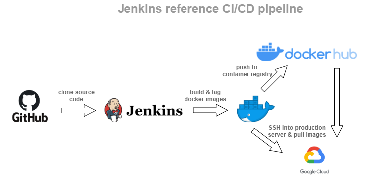
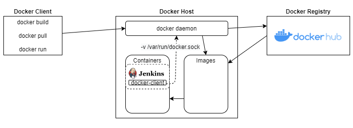

# jenkins CI/CD pipeline
Jenkins docker container with .NET Core 3.1, .NET Core 5 SDKs, Powershell Core & Docker client installed. Docker compose environment contains RabbitMQ + MSSQL Server 2017 containers (with default configs) needed for Jenkins CI/CD environemnt.


Plugins list for environment setup can be found on `plugins.txt`

## How Jenkins inside docker build & push docker images
Jenkins container use docker client and volume bind to `/var/run/docker.sock` on docker host for build and push docker images.


## run environment
```console
docker-compose up -d
```

## CI/CD Pipeline Result

